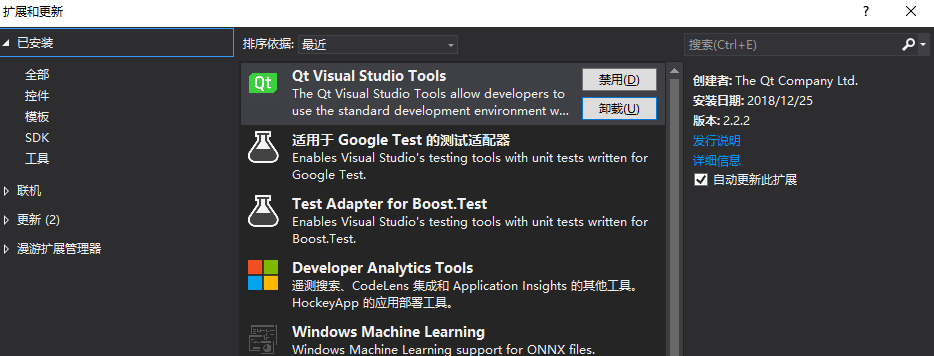
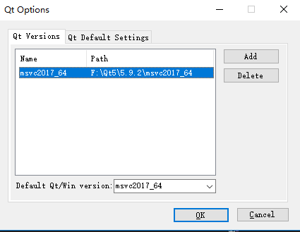
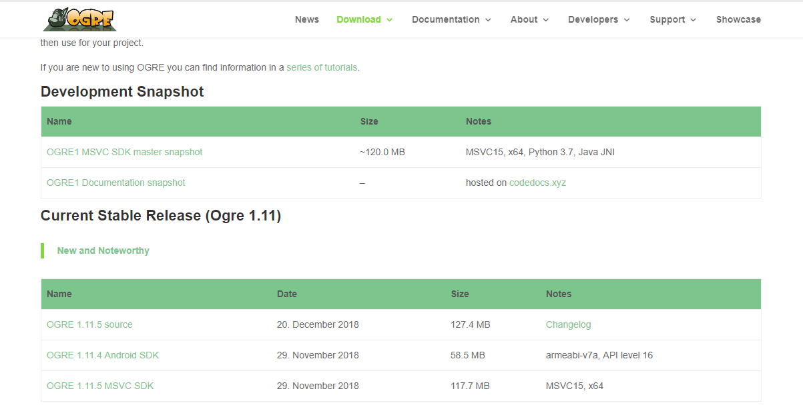
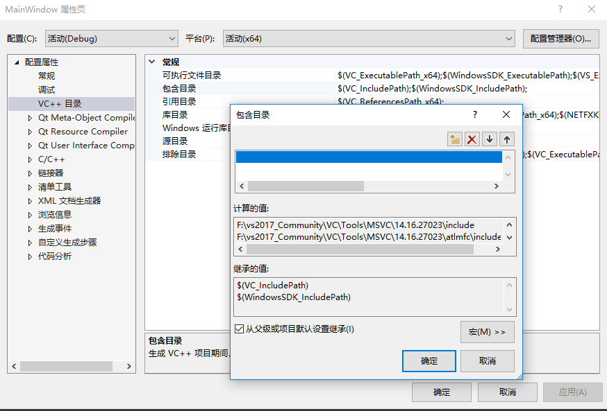
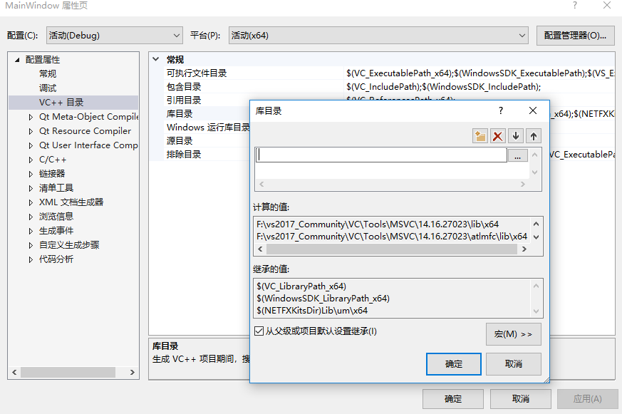
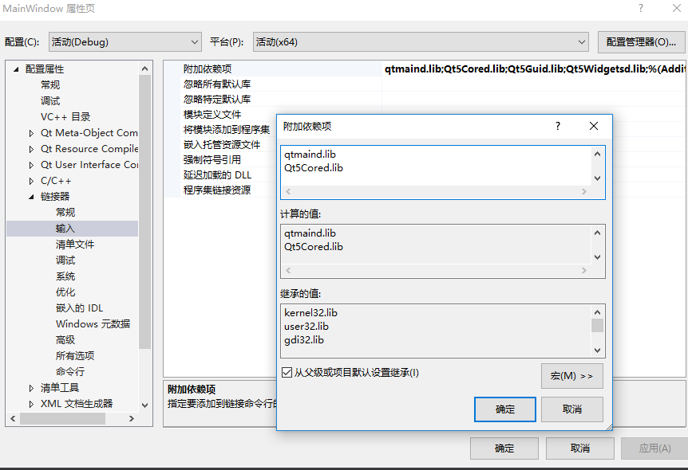

# Hierarchical Evacuation Simulation Framework（HESF）


 [](https://www.qt.io/)       [](https://www.ogre3d.org/)      [](https://en.cppreference.com/w/)       [](https://github.com/MengeCrowdSim/Menge)


<h2 id = "目录">Directory</h2>

[Brief Introduction](#软件简介)

[Software Environment](#软件运行环境)

- [Operating System](#操作系统)
- [Configuration of Visual Studio](#VisualStudio的配置要求)
- [Configuration of Qt](#Qt的配置)
- [Configuration of OGRE](#OGRE的配置)

[Demo of Result](#效果演示)

- [Conclusion](#总结)

[Download of Framework](#框架下载)


<h2 id = "软件简介">Brief Introduction</h2>

​	*In order to establish a unified visual platform for crowd evacuation simulation with high expansibility, crowd simulation under dynamic environment was carried out for different crowd evacuation models, and the extensibility of crowd simulation system was discussed. Based on the analysis and improvement of the existing open source crowd simulation framework Menge. A hierarchy structure is designed which combines the environment layer, strategy layer, tactics layer, operation layer and visualization layer.* 			   	

​	*Moreover, extension interfaces are designed at each level, and different modules are added in the form of user customization to realize the specific function expansion at each level. The simulation framework can effectively support the user to design and implement a variety of crowd evacuation simulation experiments, and has an important role in comparing the differences between different crowd evacuation simulation models.*


<h2 id = "软件运行环境">Software Environment</h2>

<h4 id = "操作系统">Operating System</h4>

​	*Windows operating system, preferably windows7 or above.*


<h4 id = "VisualStudio的配置要求">Configuration of Visual Studio</h4>

​	*It is best to use the 2013 version of Visual Studio or an updated Visual Studio that supports the V120 toolset.*


<h4 id = "Qt的配置">Configuration of Qt</h4>

​	*In this project, the open source framework Qt is used to make a Visual interface, and Qt needs to be configured in Visual Studio. The following figure shows how to configure Qt in Visual Studio using Visual Studio 2017. Note that the project uses Qt 5 version!*

​	*The first step is to find "extensions and updates" in the Visual Studio's toolbar, and then search for "Qt Visual Studio Tools" to download the plug-in.*




​	*Second, download the qt 5 toolkit from Qt's website.*

​	*Third, after rebooting Visual Studio, you can see the "Qt VS Tools" option in the toolbar, where you can select the downloaded Qt 5 toolkit.*




<h4 id = "OGRE的配置">Configuration of OGRE</h4>

​	*The graphics display of this framework uses the open source game engine OGRE to render, built-in OpenGL, no more additional configuration is required.*

​	*The first step, see the following diagram, in the website https://www.ogre3d.org/download/sdk to download OGRE SDK 1.9 and decompression. Define the OGRE SDK directory as the environment variable OGRE_HOME.*




​	*Second, configure the OGRE libraries in Visual Studio.*

​	*Open the project properties in Visual Studio and add the following items to the include directory of the VC++ directory.*

```
$(OGRE_HOME)\include
$(OGRE_HOME)\include\OIS
$(OGRE_HOME)\include\OGRE
$(OGRE_HOME)\include\OGRE\Overlay
$(OGRE_HOME)\boost
```




​	*Add the following items under the library directory of the VC++ directory.*

```
$(OGRE_HOME)\lib\$(Configuration)
$(OGRE_HOME)\boost\lib
```




​	*Find the linker options in the project's configuration properties, select the input options, and add the following items to the additional dependencies.*

​	*Debug configuration added as follows:*

```
$(OGRE_HOME)\lib\$(Configuration)
$(OGRE_HOME)\boost\lib
```

​	*Release configuration added as follows:*

```
OgreMain.lib
OIS.lib
OgreOverlay.lib
```




​	*Now that you've configured this in Visual Studio, you can try to run the framework and if you encounter problems, leave a comment on the project on github below, I will reply as soon as I can.*


<h2 id = "效果演示">Demo of Result</h2>

​	*Take nanjing.xml as an example, I'll use this framework briefly.*

​	*Here's how to run this example on the Qt interface. This example uses OpenGL to render graphics, scene is two-dimensional form, can be changed in the program to use OGRE to render scenes, you can achieve a three-dimensional scene.*


​	*Next we demonstrate how users can write custom plug-ins.*


​	*Ok, so that's the simple use of the framework, and we have a bunch of examples in the project's example folder, so you can try it out.*


<h4 id = "总结">Conclusion</h4>

​	*The hierarchical crowd evacuation simulation framework  is an improvement on the open source framework Menge simulation framework. The goal is to establish a unified visual platform for crowd evacuation simulation with high expansibility, and conduct crowd simulation under dynamic environment for different crowd evacuation models. This framework introduces thought of hierarchy, designs the hierarchy structure that combines environment layer, strategy layer, tactics layer, operation layer and visualization layer, and designs the extension interfaces in each layer, adds different modules in the form of user definition to realize the specific function extension of each level, and improves the reusability of the code. The framework effectively supports users to design and implement various crowd evacuation simulation experiments, and plays an important role in comparing the differences between different crowd evacuation simulation models. However, the framework still has many shortcomings, such as the environment layer cannot achieve environmental changes in an interactive way. The visualization of OpenGL is not good. In the following work, aiming at the above shortcomings, we will continue to improve the framework, in order to achieve the desired effect, so that users can use the framework more conveniently and quickly to achieve crowd simulation.*


[Return Top](#目录)


<h2 id="框架下载">Download of Framework</h2>

[Download zip file](https://pan.baidu.com/s/1gs3O5r1pAX29kKDc_Ro_zQ)

Extract Code:  ensf

